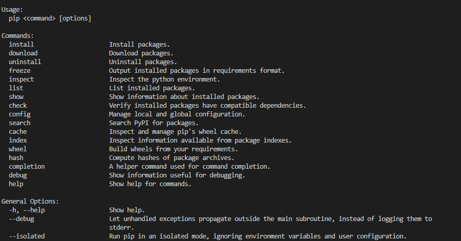
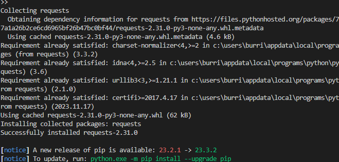

# Звіт до роботи № 4
## Тема: _Робота з віртуальнимим середовищами_
### Мета роботи: _Навчитись створювати та працювати у віртуальних середовищах Python_
---
### Виконання роботи
- Результати виконання завдання:
    1. Створили віртуальне середовище за допомогою venv та pipenv. Створені [Pipfile](./Pipfile) та [Pipfile.lock](./Pipfile.lock);
    1. Створено програму яка буде працювати у віртуальних середовищах. Код програми представлено у файлі [my.py](./my.py);
    1. Навчились створювати та працювати у віртуальних середовищах;

- результати виконання індивідуального завдання:
    - робимо завдення із зірочкою, наприкладпоказуємо що можна робити за допомогою команди pip:
    ;

    - Також зробили решту завдань та спробували заходити у віртуальні середовища;

---
### Висновок: 
> у висновку потрібно відповісти на запитання:

- :question: Що зроблено в роботі: так
- :question: Чи досягнуто мети роботи: так
- :question: Які нові знання отримано: навички роботи з віртуальними середовищами
- :question: Чи вдалось відповісти на всі питання задані в ході роботи: так
- :question: Чи вдалося виконати всі завдання: так
- :question: Чи виникли складності у виконанні завдання: ні
- :question: Чи подобається такий формат здачі роботи (Feedback): так
- :question: Побажання для покращення (Suggestions): ні

---
